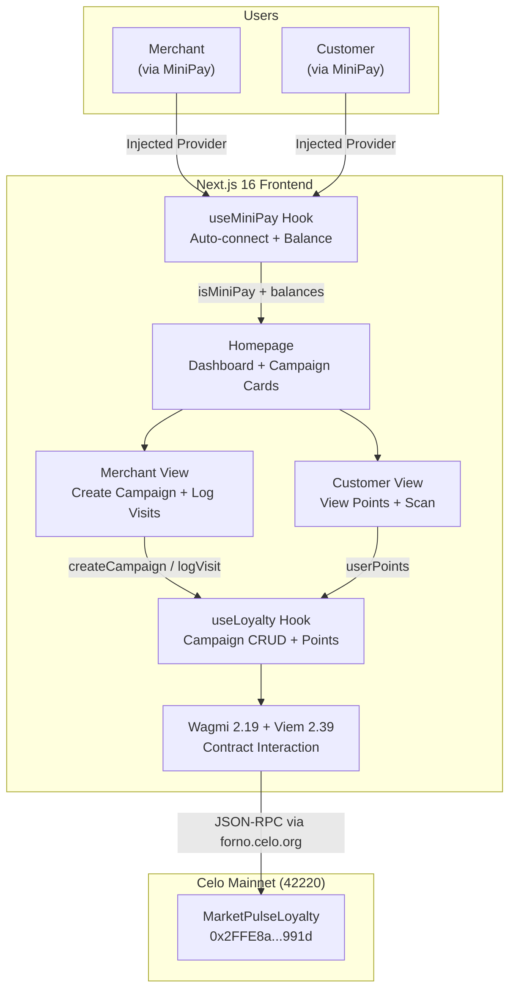
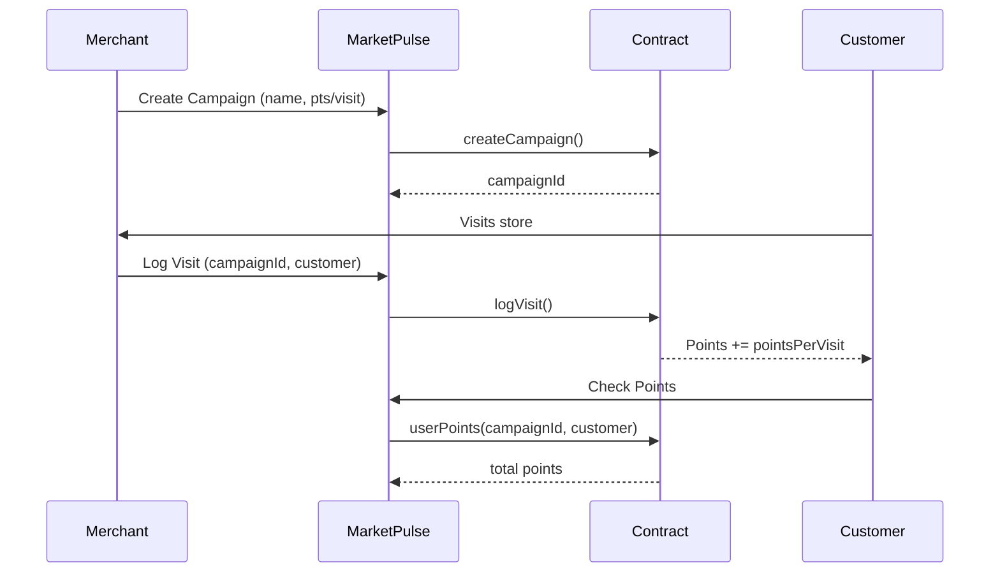

# MarketPulse Architecture

## System Overview

## Component Architecture

| Layer | Component | Purpose |
|-------|-----------|---------|
| **Entry** | `app/layout.tsx` | Root layout, theme provider, fonts |
| **Provider** | `ClientWrapper` > `ContextProvider` | WagmiProvider, QueryClient, AppKit, NetworkEnforcer, MiniPayBar |
| **Pages** | `app/page.tsx` | Main dashboard with campaign cards, analytics |
| | `app/merchant/page.tsx` | Merchant campaign creation + visit logging |
| | `app/customer/page.tsx` | Customer points view + QR scan |
| **Hooks** | `useMiniPay` | MiniPay detection, auto-connect, chain forcing, stablecoin balances |
| | `useLoyalty` | Create campaigns, log visits, read points + campaign details |
| **Contract** | `MarketPulseLoyalty.sol` | Solidity 0.8.19, on-chain loyalty points |

## Tech Stack

| Category | Technology | Version |
|----------|-----------|---------|
| Framework | Next.js (App Router) | 16.2.3 |
| UI | React | 19.2.0 |
| Styling | Tailwind CSS | 3.4.18 |
| Animation | Framer Motion | 12.38.0 |
| Web3 | Wagmi | 2.19.4 |
| Web3 | Viem | 2.39.2 |
| Wallet | Reown AppKit | 1.8.14 |
| Icons | Lucide React | 1.16.0 |
| Deploy | Cloudflare Pages | via OpenNext |

## Smart Contract

**MarketPulseLoyalty** (Solidity 0.8.19)
- `createCampaign(string name, uint256 pointsPerVisit)` -- merchant creates loyalty program
- `logVisit(uint256 campaignId, address customer)` -- merchant logs customer visit, awards points
- `campaigns(uint256)` -- returns `(merchant, name, pointsPerVisit, active)`
- `userPoints(uint256, address)` -- returns accumulated points for a customer in a campaign
- Events: `CampaignCreated`, `VisitLogged`

## Dual-Sided Flow

